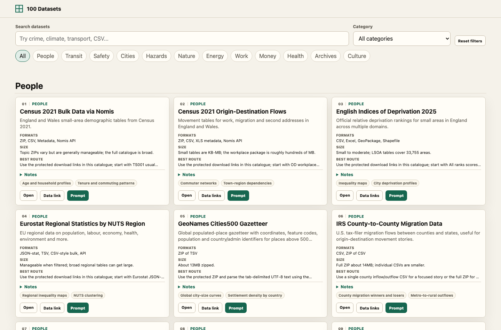

# 100 Datasets

Start here: [open the live HTML catalogue](https://petergpt.github.io/100-datasets/).

This is a browsable collection of 100 datasets that are good for student data exploration projects. The datasets were chosen because they are openly accessible, downloadable without an account, and available in formats that ordinary tools and AI agents can handle.



## What This Is For

Use this when you need a dataset for an analysis, visualisation, mapping project, statistics exercise, or exploratory notebook, but you do not want to spend hours fighting broken links, login walls, API keys, or giant archives.

Each dataset card gives you:

- a short explanation of what the data contains
- the expected file format and size
- a source page you can open in a browser
- a protected **Data link** button that copies the direct download URL
- a **Prompt** button that copies instructions for an AI agent
- caveats and story ideas to help you analyse the data responsibly

## How To Find A Dataset

1. Open the [live HTML catalogue](https://petergpt.github.io/100-datasets/).
2. Search for a topic, place, format, or keyword, such as `crime`, `weather`, `CSV`, `transport`, `health`, or `maps`.
3. Use the category buttons to browse broad areas like **People**, **Transit**, **Safety**, **Hazards**, **Health**, **Archives**, or **Culture**.
4. Pick a card that looks interesting and check the format, size, access notes, and caveats.
5. Click **Data link** to copy the actual download URL, or click **Prompt** to copy a ready-made instruction for an AI agent.

The **Data link** button copies the URL instead of opening it directly. That is deliberate: some data files are large enough that accidental clicks would be annoying.

## Copy This Prompt For An AI Agent

If you are using ChatGPT, Codex, Claude, Gemini, or another AI coding/data agent, you can start with this:

```text
I want to choose a dataset for a student data exploration project.

Please use this catalogue: https://petergpt.github.io/100-datasets/

First read the machine-readable manifest here:
https://petergpt.github.io/100-datasets/datasets.json

Help me choose 3 suitable datasets for the topic I give you. For each one, explain:
- what story or question I could explore
- what format the data is in
- roughly how large or manageable it is
- what caveats I should keep in mind

After I choose one dataset, use its download_links field to fetch the data. Start with a manageable subset if the dataset is large or API-based. Then summarise the rows, columns, coverage, missing values, and 3 possible visualisations or analyses.

My topic or interest is: [replace this with your topic]
```

If you already know which dataset you want, open its card in the catalogue and use the card’s **Prompt** button instead. That gives your agent dataset-specific links, notes, and access instructions.

## What Counts As “Good” Here

The catalogue favours datasets that are:

- openly downloadable or queryable without login or API keys
- in familiar formats such as CSV, JSON, GeoJSON, XLSX, GTFS, or shapefile ZIPs
- small enough, or subsettable enough, for a normal project
- rich enough to support a real question, chart, map, timeline, ranking, or comparison
- documented well enough that you can understand the source and limitations

The datasets themselves still belong to their original publishers. Always keep the source, licence notes, and caveats with your analysis.

## Categories

The 100 datasets are grouped into 12 short categories:

| Category | Count |
| --- | ---: |
| People & Places | 11 |
| Transit & Travel | 14 |
| Public Safety | 10 |
| Homes & Cities | 8 |
| Weather & Hazards | 8 |
| Nature & Science | 5 |
| Energy & Emissions | 5 |
| Work & Trade | 6 |
| Money & Organisations | 6 |
| Health & Food | 7 |
| Arts & Archives | 9 |
| Culture & Leisure | 11 |

## For Agents And Advanced Users

The easiest machine-readable route is:

[https://petergpt.github.io/100-datasets/datasets.json](https://petergpt.github.io/100-datasets/datasets.json)

Each dataset has a stable `id`, and each card can be opened directly with a URL fragment. For example:

[https://petergpt.github.io/100-datasets/#census-2021-bulk](https://petergpt.github.io/100-datasets/#census-2021-bulk)

There is also a short agent route map at:

[https://petergpt.github.io/100-datasets/llms.txt](https://petergpt.github.io/100-datasets/llms.txt)

## Licence

The catalogue code and metadata in this repository are released under the MIT License. The datasets themselves are owned and licensed by their original publishers.
